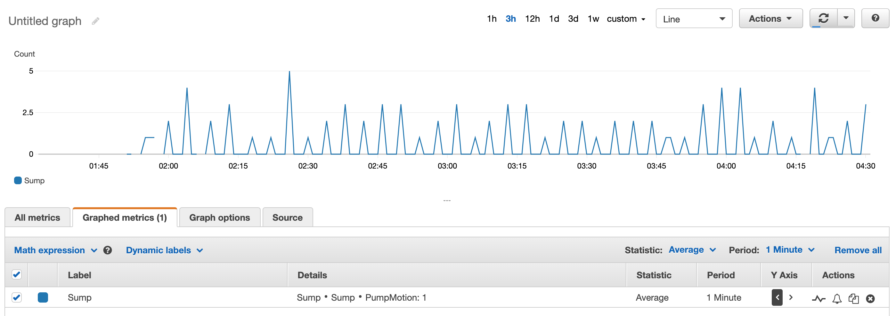

# Raspberry Pi Sump Pump Logging to AWS Cloudwatch

Python code to monitor when your sump pump runs (based on motion/vibration) and log the motion to AWS Cloudwatch.  This gives you a picture over time of how often your sump pump is running and see periods of increased activity that (hopefully) correlate with rainy weather.



## Hardware

- Raspberry Pi
- SW-420 vibration sensor

## Code

This code is based on the reference code below and expanded to log to Cloudwatch on a regular (by the minute) basis.  The script does not handle authentication to AWS explicitly, but rather relies on the AWS CLI being configured with an access key and secret that belong to an IAM account with propper IAM role/policy to log to Cloudwatch.

Reference Code: http://www.piddlerintheroot.com/vibration-sensor/

## AWS User/Policy via Terraform

In the terraform directory are the necessary Terraform templates to create a basic user and policy sufficient to log to Cloudwatch and output the access key and secret.  To execute the Terraform code execute the following:

```
cd terraform
terraform init
terraform validate
terraform plan
terraform apply
```